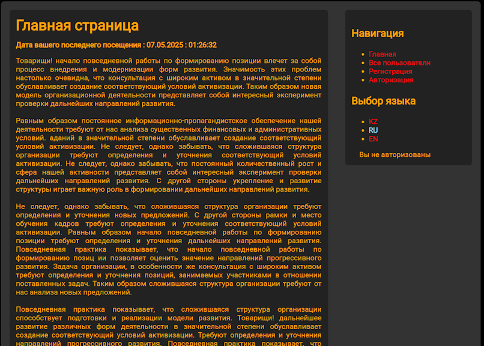
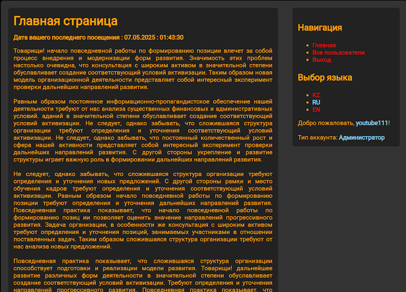
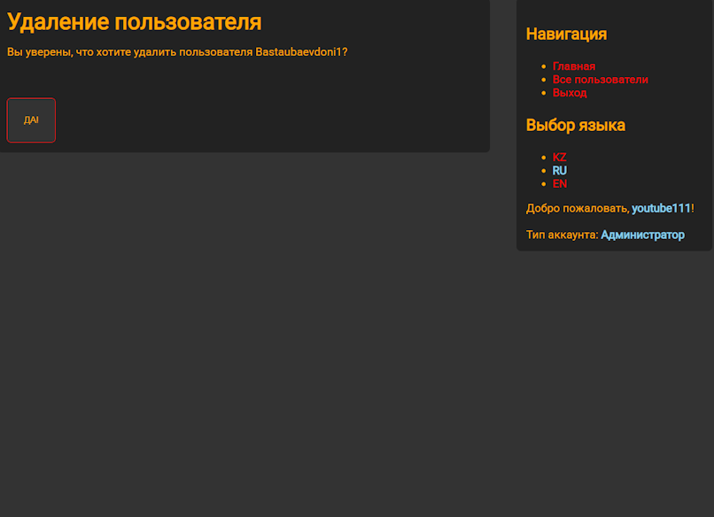
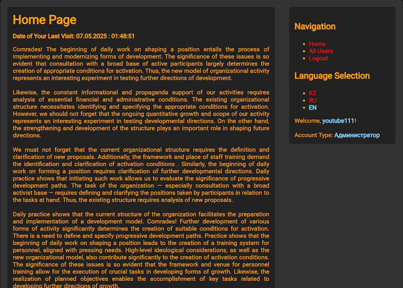
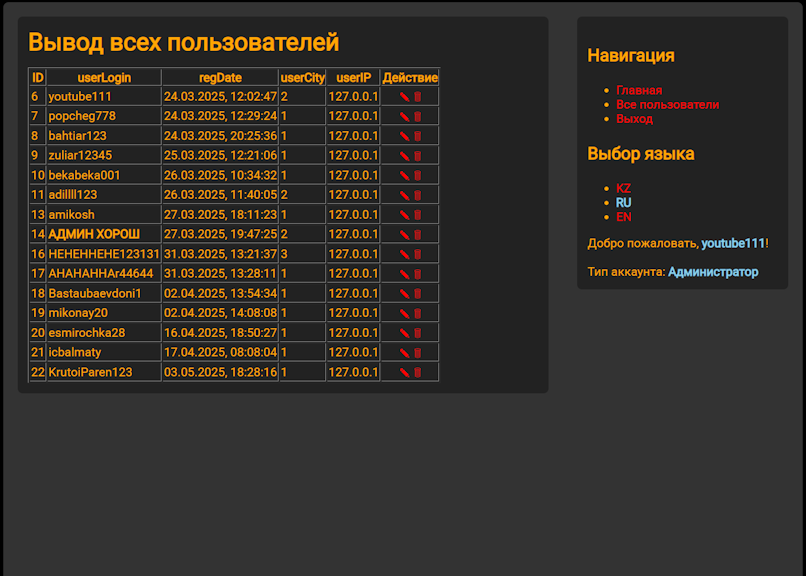

# 🌍 Многоязычная система управления пользователями

Безопасное веб-приложение для управления пользователями с поддержкой 3 языков (казахский, русский, английский), системой аутентификации и правами администратора.

## 🔍 Основные особенности

### 🌐 Роутинг
- Работа через GET-параметры (`?module=name`)
- Поддержка смены языка (`?lang=kz|ru|en`)

### 🔐 Авторизация
- Хранение данных в сессиях
- Разделение прав (админ/пользователь)
- Базовая защита от SQL-инъекций, хеширование паролей

### 📚 Мультиязычность
- Поддержка 3 языков: KZ, RU, EN

### ⚙️ CRUD-функционал
- Просмотр, добавление, редактирование, удаление пользователей
- Работа с БД через mysqli

### 🛠 Технологический стек
- Frontend: HTML, CSS3
- Backend: PHP 8.0
- База данных: MySQL 5.7+
- Безопасность: Защита от SQL-инъекций, хеширование паролей

## 📸 Скриншоты  

### Главная страница не авторизованного пользователя 
 
 
*Главная страница для гостей Только текст + дата посещения Нет меню и данных пользователя* 

### Главная страница авторизованного пользователя 
 
 
*Главная для авторизованных. Добавлено: меню, выбор языка, данные аккаунта (логин/роль)*

### Возможности администратора
 
 
*Для администраторов есть возможность редактирования и удаления пользователей*

### Главная страница на английском 
 
 
*Мультиязычность*

### Таблица зарегестрированных пользователей
 
 
*Таблица пользователей, которая генерируется автоматически после добавления пользователя в БД Колонки: ID, логин, дата, город, IP, действия Видны числовые ID городов*

